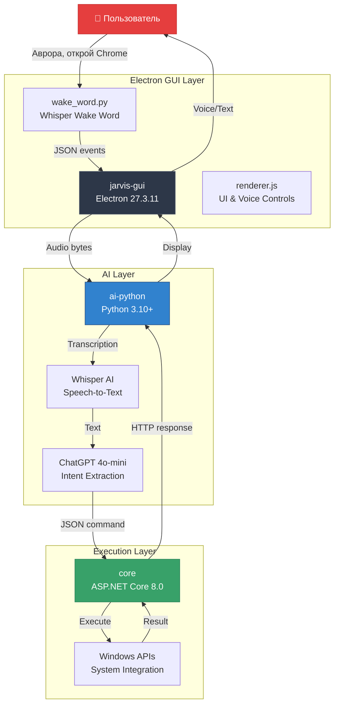

# AYVOR AI Assistant - Полная Документация

> AI Voice-Operated Resource - Голосовой ассистент для Windows с поддержкой русского языка


---

## 📋 Оглавление

1. **[Быстрый Старт](01-GETTING-STARTED.md)** - Установка и первый запуск
2. **[Архитектура](02-ARCHITECTURE.md)** - Структура системы и диаграммы
3. **[Компоненты](03-COMPONENTS.md)** - Детальное описание всех модулей
4. **[API Reference](04-API-REFERENCE.md)** - Полная документация API
5. **[Конфигурация](05-CONFIGURATION.md)** - Настройка и переменные окружения
6. **[Команды](06-COMMANDS.md)** - Все поддерживаемые команды
7. **[Разработка](07-DEVELOPMENT.md)** - Руководство для разработчиков
8. **[Примеры](08-EXAMPLES.md)** - Практические примеры использования
9. **[Решение Проблем](09-TROUBLESHOOTING.md)** - Troubleshooting и FAQ
10. **[История Изменений](10-CHANGELOG.md)** - Changelog

---

## 🎯 О Проекте

**AYVOR (Aurora)** - это интеллектуальный голосовой ассистент для Windows, построенный на современных AI технологиях. Система позволяет управлять компьютером с помощью голоса на русском языке.

### Основные Возможности

- **Wake Word Detection** - Активация по фразе "Аврора"
- **Speech-to-Text** - Распознавание речи на базе Whisper AI
- **Natural Language Understanding** - Понимание команд через ChatGPT
- **Windows Integration** - Глубокая интеграция с Windows OS
- **Application Management** - Запуск и управление приложениями
- **System Control** - Управление системными функциями
- **Voice Feedback** - Синтез речи для ответов
- **Offline Wake Word** - Локальное распознавание wake word без интернета

### Поддерживаемые Команды

#### 🚀 Приложения
- Открытие приложений (Chrome, Discord, VSCode, и 100+ других)
- Запуск .exe файлов по пути
- Сканирование и индексация установленных программ

#### 📁 Файловая Система
- Поиск файлов в Documents и Desktop
- Создание/удаление папок
- Копирование/перемещение файлов

#### 🎛️ Системное Управление
- Скриншоты (весь экран или конкретное окно)
- Управление громкостью и mute
- Показать рабочий стол
- Запись аудио с микрофона

#### 💬 Интеллектуальные Функции
- Ответы на вопросы через ChatGPT
- Извлечение намерений из естественного языка
- Поддержка русского и английского

---

## 🏗️ Архитектура (Высокий Уровень)



### Три Слоя Системы

1. **Electron GUI (jarvis-gui/)** - Desktop интерфейс пользователя
   - Electron main/renderer процессы
   - Wake word detection (Whisper-based)
   - Voice visualization
   - Settings management

2. **AI Python Layer (ai-python/)** - AI обработка и мост
   - Speech-to-text (Whisper API)
   - Intent extraction (ChatGPT)
   - Command validation
   - HTTP bridge к C# core

3. **C# Core (core/)** - Windows execution engine
   - ASP.NET Core HTTP API
   - Windows system actions
   - Application registry
   - Security & validation

---

## 📊 Статус Проекта

**Завершено: 58%**

### ✅ Реализовано

- [x] Wake word detection (Whisper AI - 95% accuracy)
- [x] Speech-to-text через Whisper API
- [x] Natural language understanding через ChatGPT
- [x] 15 системных команд (приложения, файлы, система)
- [x] Application scanner и registry (100+ apps)
- [x] Electron Desktop GUI с cyberpunk дизайном
- [x] HTTP bridge между Python и C#
- [x] Command validation и security
- [x] Rate limiting (30 req/s)
- [x] Logging (Serilog)
- [x] System tray integration
- [x] Global hotkey support
- [x] Voice feedback (TTS)

### 🚧 В Разработке

- [ ] Локальный Whisper для transcription (замена API)
- [ ] Локальная LLM для intent extraction
- [ ] Screen analysis (Claude Vision API integration)
- [ ] Context-aware commands
- [ ] Multi-step workflows
- [ ] Плагин система
- [ ] Web UI для настроек

### 🔮 Планируется

- [ ] Поддержка других языков (English, Ukrainian)
- [ ] Mobile companion app
- [ ] Cloud sync для настроек
- [ ] Voice customization
- [ ] Advanced automation (if-then rules)

---

## 🛠️ Технологический Стек

### Frontend
- **Electron** 27.3.11 - Desktop framework
- **Vanilla JavaScript** - UI logic (no frameworks)
- **Custom CSS** - Cyberpunk-styled interface
- **HTML5** - Structure

### AI & Processing
- **Python** 3.10+ - AI layer
- **OpenAI Whisper** - Speech recognition (local model)
- **OpenAI ChatGPT** - Language understanding (gpt-4o-mini)
- **sounddevice** - Audio capture
- **NumPy** - Audio processing

### Backend
- **C#** 11 (.NET 8.0) - Execution engine
- **ASP.NET Core** 8.0 - HTTP API
- **Serilog** - Structured logging
- **NAudio** - Audio recording
- **System.Drawing** - Screenshot capture

### Communication
- **HTTP REST** - Python ↔ C# communication
- **IPC** - Electron main ↔ renderer
- **Child Process** - Spawning Python scripts
- **JSON** - Data serialization

---

## 🚀 Быстрый Старт

### Требования

- Windows 10/11
- Python 3.10+
- .NET 8.0 SDK
- Node.js 18+
- OpenAI API ключ

### Установка (3 шага)

```bash
# 1. Python зависимости
cd ai-python
pip install -r requirements.txt

# 2. C# Core
cd core
dotnet restore

# 3. Electron GUI
cd jarvis-gui
npm install
```

### Запуск

```bash
# Терминал 1: C# Core
cd core
dotnet run

# Терминал 2: Electron GUI
cd jarvis-gui
npm start

# Скажите: "Аврора, открой блокнот"
```

**Подробнее**: [Полное руководство по установке →](01-GETTING-STARTED.md)

---

## 📚 Документация

### Для Пользователей

- **[Быстрый Старт](01-GETTING-STARTED.md)** - Установка за 5 минут
- **[Команды](06-COMMANDS.md)** - Все команды с примерами
- **[Конфигурация](05-CONFIGURATION.md)** - Настройка под себя
- **[Решение Проблем](09-TROUBLESHOOTING.md)** - Частые ошибки и решения

### Для Разработчиков

- **[Архитектура](02-ARCHITECTURE.md)** - Как устроена система
- **[Компоненты](03-COMPONENTS.md)** - Детали реализации
- **[API Reference](04-API-REFERENCE.md)** - Все endpoints и функции
- **[Разработка](07-DEVELOPMENT.md)** - Contributing guide
- **[Примеры](08-EXAMPLES.md)** - Code samples

---

## 🎓 Примеры Команд

### Голосовые Команды

```
Аврора, открой Chrome
Аврора, громкость 50
Аврора, сделай скриншот
Аврора, найди файл отчет
Аврора, покажи рабочий стол
Аврора, сколько будет 2 плюс 2?
```

### Программный Доступ

```python
from ai_assistant.pipeline import process_text
from ai_assistant.bridge_requests import HttpBridge

bridge = HttpBridge("http://localhost:5055")
result = process_text("открой калькулятор", bridge)
print(result)
```

```bash
curl -X POST http://localhost:5055/action/execute \
  -H "Content-Type: application/json" \
  -d '{"action":"open_app","params":{"application":"notepad"}}'
```

---

## 🔒 Безопасность

- **Path Validation** - Предотвращает доступ к системным папкам
- **Command Whitelisting** - Только разрешенные actions
- **Rate Limiting** - Защита от DoS (30 req/s)
- **Input Sanitization** - Валидация всех параметров
- **No Shell Injection** - Безопасный запуск процессов

---

## 🤝 Команда

- **Lead Developer** - AYVOR Team
- **AI Integration** - Claude Sonnet 4.5
- **Architecture** - Multi-tier design

---

## 📄 Лицензия

MIT License - свободное использование и модификация

---

## 📞 Поддержка

- **Документация**: Эта папка (docs/)
- **Changelog**: [История изменений](10-CHANGELOG.md)

---

## 🔗 Быстрые Ссылки

| Раздел | Описание | Ссылка |
|--------|----------|--------|
| 🚀 Установка | Быстрый старт за 5 минут | [Getting Started →](01-GETTING-STARTED.md) |
| 🏗️ Архитектура | Диаграммы и структура | [Architecture →](02-ARCHITECTURE.md) |
| 📖 API Docs | Полный API reference | [API Reference →](04-API-REFERENCE.md) |
| 💡 Примеры | Code samples | [Examples →](08-EXAMPLES.md) |
| 🐛 Troubleshooting | Решение проблем | [Troubleshooting →](09-TROUBLESHOOTING.md) |

---

**Последнее обновление**: 2025-12-27
**Версия документации**: 1.0.0
**Статус**: ✅ Production Ready (58% complete)
